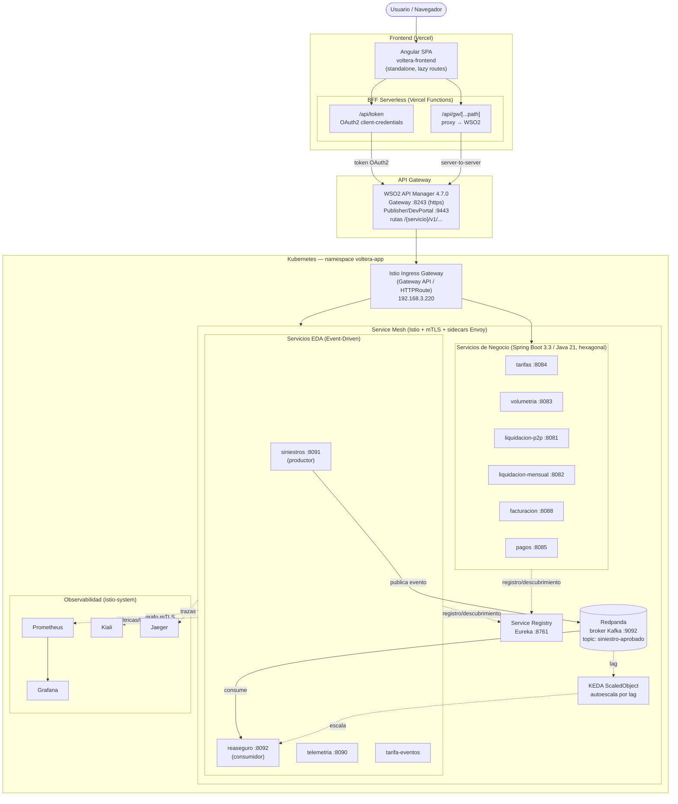
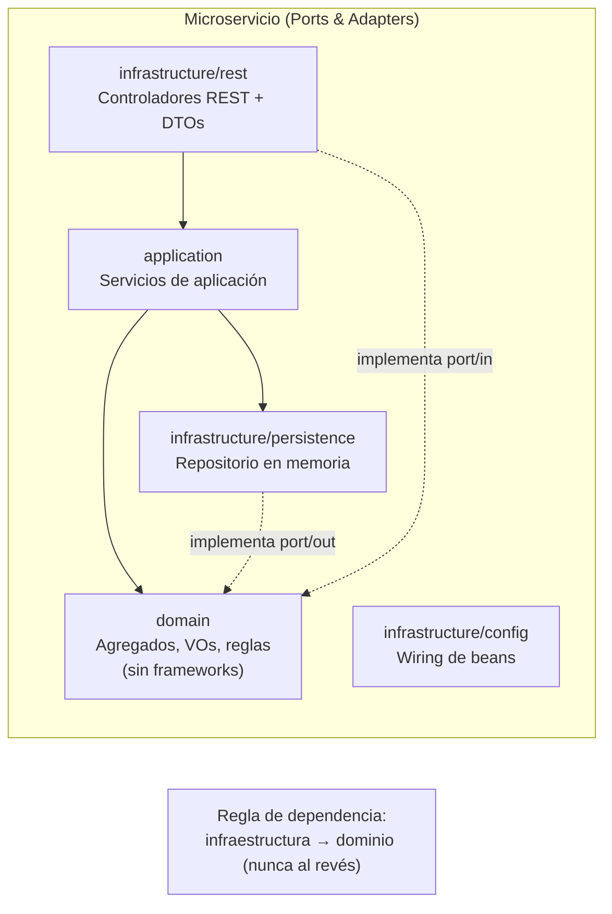
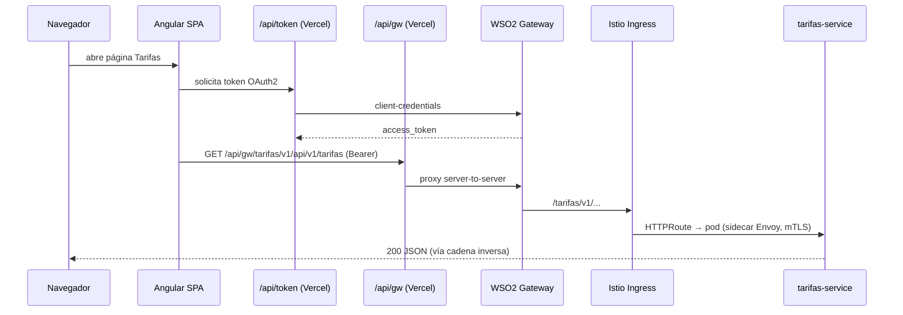
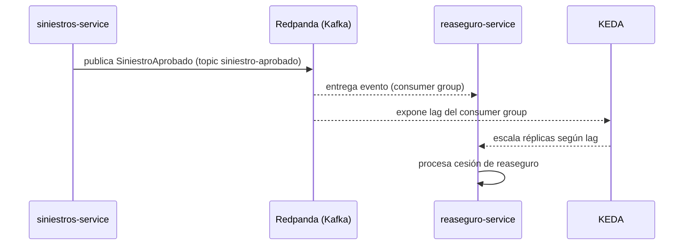

# Voltera — Arquitectura Actual (Front + Backend)

Diagrama de la arquitectura de extremo a extremo tal como está implementada hoy:
Angular SPA → BFF serverless (Vercel) → WSO2 API Gateway → Istio Ingress →
microservicios Spring Boot (arquitectura hexagonal) sobre Kubernetes, con capa
EDA (Redpanda/Kafka + KEDA), service mesh (Istio + mTLS) y observabilidad
(Prometheus, Grafana, Kiali, Jaeger).

## Vista general (C4 - Contenedores)

## Detalle del backend hexagonal (por microservicio)

## Componentes y puertos

### Frontend
| Componente | Tecnología | Detalle |
|---|---|---|
| SPA | Angular (standalone, rutas lazy) | Páginas: dashboard, tarifas, volumetría, liquidación P2P/mensual, facturación, pagos, siniestros, reaseguro, telemetría, tarifa-eventos, observabilidad, patrones, experimentos |
| BFF | Vercel Serverless Functions | `/api/gw/[...path]` (proxy a WSO2), `/api/token` (OAuth2). Oculta el `consumerSecret`, evita CORS y el cert autofirmado del gateway |
| Hosting | Vercel | `voltera-frontend.vercel.app` |

### API Gateway
| Componente | Puerto | Detalle |
|---|---|---|
| WSO2 API Manager 4.7.0 | 8243 (https), 8280 (http), 9443 (Publisher/DevPortal) | Publicación, ciclo de vida, throttling. Rutas `/{servicio}/v1/api/v1/...` |

### Servicios de negocio (Spring Boot 3.3 / Java 21, hexagonal)
| Servicio | Puerto | Agregado raíz |
|---|---|---|
| tarifas | 8084 | `Tarifa` |
| volumetria | 8083 | `LecturaTelemetria` |
| liquidacion-p2p | 8081 | `TransaccionP2P` |
| liquidacion-mensual | 8082 | liquidación mensual |
| facturacion | 8088 | `Factura` |
| pagos | 8085 | `OrdenPago` |

### Servicios EDA
| Servicio | Puerto | Rol |
|---|---|---|
| siniestros | 8091 | Productor del evento `SiniestroAprobado` |
| reaseguro | 8092 | Consumidor de `siniestro-aprobado` (autoescala KEDA por lag) |
| telemetria | 8090 | Telemetría / métricas |
| tarifa-eventos | — | Tarifa basada en eventos |

### Infraestructura
| Componente | Detalle |
|---|---|
| Service Registry | Eureka :8761 (descubrimiento) |
| Broker | Redpanda (compatible Kafka) :9092, single-node |
| Orquestación | Kubernetes (namespace `voltera-app`) + Docker Compose (local) |
| Service Mesh | Istio + Envoy sidecars, mTLS (PeerAuthentication), DestinationRules (circuit breaker), HPA, PodDisruptionBudget |
| Autoescalado eventos | KEDA ScaledObject |
| Ingress | Istio Ingress Gateway (Gateway API / HTTPRoute) 192.168.3.220 |
| Registry de imágenes | Harbor `192.168.3.13/app-voltaire` |
| Observabilidad | Prometheus, Grafana, Kiali, Jaeger |

## Flujo de una petición (ejemplo)

## Flujo de un evento (EDA)

